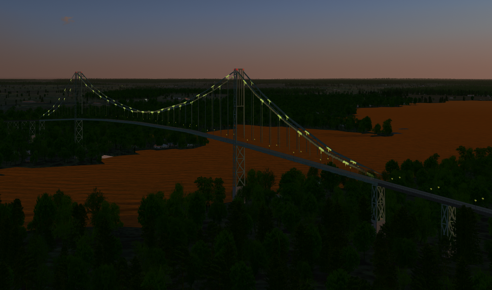

Blender model of the Thousand Islands Bridge
============================================
This is a Public Domain, low-polygon model of the Thousand Islands Bridge across the St. Lawrence River, connecting U.S. Interstate 81 to Ontario Highway 401. It is optimised for use in flight simulators, where it will not be viewed close up, but it is possible to simulate driving across the bridge.

Closest airport: [Maxson Airfield](https://ourairports.com/airports/89NY/) (89NY).

## Changes

### 2024-10-24

- added lighting and streetlamps to south span, and submitted to the FlightGear Scenery Database

### 2024-10-20

- south (American) span is complete except for lighting

## UnLicense

This model is released into the Public Domain. See UNLICENSE.md for details.

## Author

Started by David Megginson, August 2024.  Attribution is appreciated, but not required.
